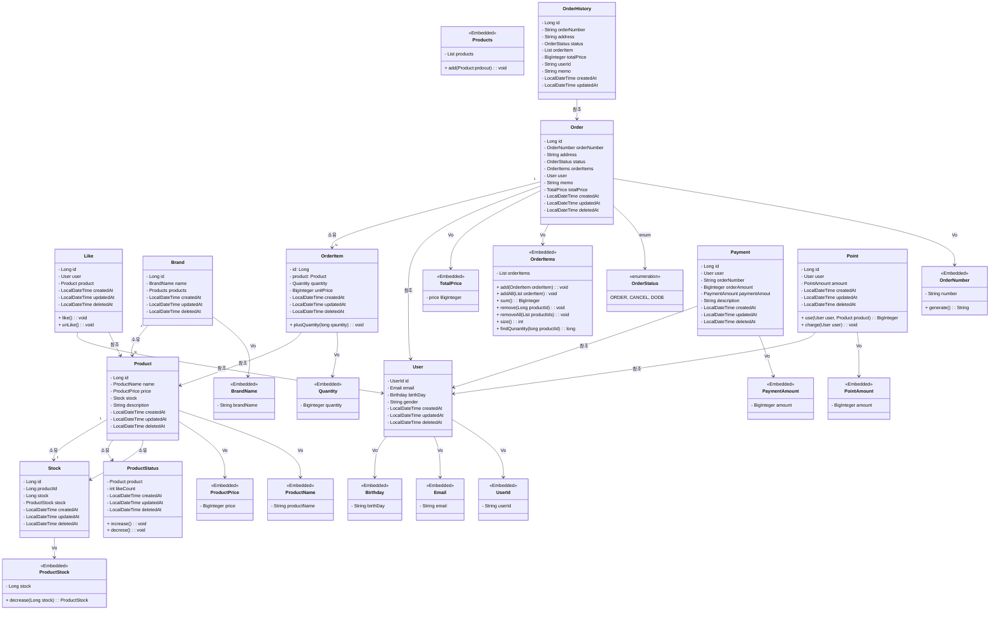

# 클래스 다이어그램

```mermaid
classDiagram


%% 계정        
class User {
   - UserId id
   - Email email
   - Birthday birthDay
   - String gender
   - LocalDateTime createdAt
   - LocalDateTime updatedAt
   - LocalDateTime deletedAt
}

class UserId {
    <<Embedded>>
 - String userId
}

class Email {
  <<Embedded>>
   - String email
}

class Birthday {
    <<Embedded>>
    - String birthDay
}


User --> UserId : Vo
User --> Email : Vo
User --> Birthday : Vo


%% 좋아요
class Like {
 - Long id
 - User user
 - Product product
 - LocalDateTime createdAt
 - LocalDateTime updatedAt
 - LocalDateTime deletedAt 
 
 + like(): void
 + unLike(): void
}

%% 브랜드
class Brand {
 - Long id
 - BrandName name
 - Products products
 - LocalDateTime createdAt
 - LocalDateTime updatedAt
 - LocalDateTime deletedAt
}

class BrandName {
 <<Embedded>>
 - String brandName
}

class Products {
 <<Embedded>>
 - List<Product> products
    
 + add(Product:prdocut): void
}

Brand --> BrandName : Vo


%% 상품
class Product {
 - Long id
 - ProductName name
 - ProductPrice price
 - Stock stock
 - String description
 - LocalDateTime createdAt
 - LocalDateTime updatedAt
 - LocalDateTime deletedAt
}

%% 좋아요된 상품
class ProductStatus { 
 - Product product
 - int likeCount
 - LocalDateTime createdAt
 - LocalDateTime updatedAt
 - LocalDateTime deletedAt

 + increase(): void
 + decrese(): void
}

class ProductName {
 <<Embedded>>
 - String productName
}

class ProductPrice {
 <<Embedded>>
 - BigInteger price
}

Product --> ProductName : Vo
Product --> ProductPrice : Vo
Product --> Stock : 소유
Product --> ProductStatus : 소유

%% 재고
class Stock { 
 - Long id
 - Long productId
 - Long stock
 - ProductStock stock
 - LocalDateTime createdAt
 - LocalDateTime updatedAt
 - LocalDateTime deletedAt
 
}

class ProductStock {
 <<Embedded>>
 - Long stock
 + decrease(Long stock): ProductStock
}

Stock --> ProductStock : Vo

%% 주문
class Order {
 - Long id
 - OrderNumber orderNumber
 - String address
 - OrderStatus status
 - OrderItems orderItems
 - User user
 - String memo
 - TotalPrice totalPrice
 - LocalDateTime createdAt
 - LocalDateTime updatedAt
 - LocalDateTime deletedAt
}

class TotalPrice {
 <<Embedded>>
 - price BigInteger
}

class OrderItems {
 <<Embedded>>
 - List<OrderItem> orderItems
 + add(OrderItem orderItem) : void
 + addAll(List<OrderItem> orderItem) void
 + sum() : BigInteger
 + remove(Long productId) : void
 + removeAll(List<Long> productIds) : void
 + size() : int
 + findQunantity(long productId) : long
}


class OrderNumber {
 <<Embedded>>
 - String number
    
 + generate() : String
}

class OrderStatus {
 <<enumeration>>
 ORDER, CANCEL,  DODE
}

Order --> OrderNumber : Vo
Order --> OrderStatus : enum
Order --> OrderItems : Vo
Order --> TotalPrice : Vo

%% 주문 내역
class OrderHistory { 
  - Long id
  - String orderNumber
  - String address
  - OrderStatus status
  - List<OrderItem> orderItem
  - BigInteger totalPrice
  - String userId
  - String memo
  
  - LocalDateTime createdAt
  - LocalDateTime updatedAt
}


%% 주문 상품
class OrderItem {
  - id: Long
  - product: Product

  - Quantity quantity
  - BigInteger unitPrice
  - LocalDateTime createdAt
  - LocalDateTime updatedAt
  - LocalDateTime deletedAt
  + plusQuantity(long qauntity) : void
}

class Quantity {
    <<Embedded>>
    - BigInteger quantity
}

OrderItem --> Quantity : Vo

%% 결제
class Payment { 
  - Long id
  - User user
  - String orderNumber
  - BigInteger orderAmount
  - PaymentAmount paymentAmout
  - String description
  - LocalDateTime createdAt
  - LocalDateTime updatedAt
  - LocalDateTime deletedAt
}

class PaymentAmount {
   <<Embedded>>
   - BigInteger amount
}

Payment --> PaymentAmount :Vo
%% 포인트
class Point { 
  - Long id
  - User user
  - PointAmount amount
  - LocalDateTime createdAt
  - LocalDateTime updatedAt
  - LocalDateTime deletedAt
  + use(User user, Product product) : BigInteger
  + charge(User user) : void
}

class PointAmount {
    <<Embedded>>
  - BigInteger amount
}

Point --> PointAmount : Vo

Brand "1" --> "N" Product : 소유
Like --> Product : 참조    
Like --> User : 참조

Order --> User : 참조
Order "1" --> "N" OrderItem : 소유

OrderHistory --> Order : 참조
OrderItem --> Product : 참조
Payment --> User : 참조
Point --> User : 참조

Product "1" --> "1" Stock : 소유

```
