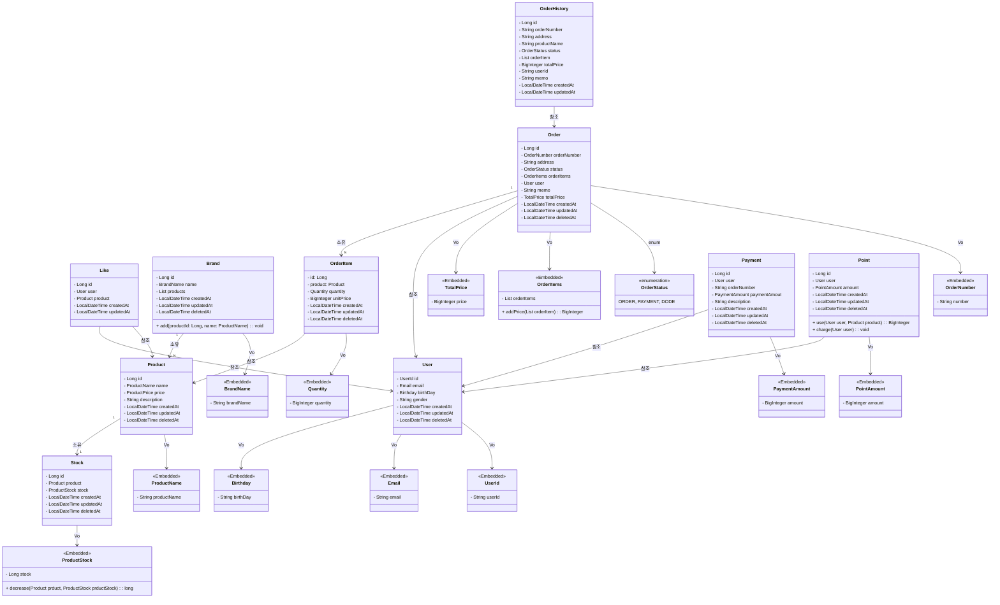

# 클래스 다이어그램

```mermaid
classDiagram


%% 계정        
class User {
   - UserId id
   - Email email
   - Birthday birthDay
   - String gender
   - LocalDateTime createdAt
   - LocalDateTime updatedAt
   - LocalDateTime deletedAt
}

class UserId {
    <<Embedded>>
 - String userId
}

class Email {
  <<Embedded>>
   - String email
}

class Birthday {
    <<Embedded>>
    - String birthDay
}


User --> UserId : Vo
User --> Email : Vo
User --> Birthday : Vo


%% 좋아요
class Like {
    - Long id
    - User user
    - Product product
    - LocalDateTime createdAt
    - LocalDateTime updatedAt
}


%% 브랜드
class Brand {
    - Long id
    - BrandName name
    - List<Product> products
    - LocalDateTime createdAt
    - LocalDateTime updatedAt
    - LocalDateTime deletedAt
  
    + add(productId: Long, name: ProductName): void 
}

class BrandName {
    <<Embedded>>
    - String brandName
}

Brand --> BrandName : Vo


%% 상품
class Product {
    - Long id
    - ProductName name
    - ProductPrice price
    - String description
    - LocalDateTime createdAt
    - LocalDateTime updatedAt
    - LocalDateTime deletedAt
}

class ProductName {
    <<Embedded>>
    - String productName
}

Product --> ProductName : Vo

%% 재고
class Stock { 
 - Long id
 - Product product
 - ProductStock stock
 - LocalDateTime createdAt
 - LocalDateTime updatedAt
 - LocalDateTime deletedAt
 
}

class ProductStock {
    <<Embedded>>
    - Long stock
    + decrease(Product prduct, ProductStock prductStock): long
}

Stock --> ProductStock : Vo

%% 주문
class Order {
  - Long id
  - OrderNumber orderNumber
  - String address
  - OrderStatus status
  - OrderItems orderItems
  - User user
  - String memo
  - TotalPrice totalPrice
  - LocalDateTime createdAt
  - LocalDateTime updatedAt
  - LocalDateTime deletedAt
}


class OrderItems {
    <<Embedded>>
    - List<OrderItem> orderItems
    + addPrice(List<OrderItem> orderItem) : BigInteger
}

class TotalPrice {
    <<Embedded>>
    - BigInteger price
}

class OrderNumber {
    <<Embedded>>
    - String number
}

class OrderStatus {
    <<enumeration>>
    ORDER, PAYMENT, DODE
}

Order --> OrderNumber : Vo
Order --> OrderStatus : enum
Order --> OrderItems : Vo
Order --> TotalPrice : Vo

%% 주문 내역
class OrderHistory { 
  - Long id
  - String orderNumber
  - String address
  - String productName
  - OrderStatus status
  - List<OrderItem> orderItem
  - BigInteger totalPrice
  - String userId
  - String memo
  
  - LocalDateTime createdAt
  - LocalDateTime updatedAt
}


%% 주문 상품
class OrderItem {
  - id: Long
  - product: Product

  - Quantity quantity
  - BigInteger unitPrice
  - LocalDateTime createdAt
  - LocalDateTime updatedAt
  - LocalDateTime deletedAt
}

class Quantity {
    <<Embedded>>
    - BigInteger quantity
}

OrderItem --> Quantity : Vo

%% 결제
class Payment { 
  - Long id
  - User user
  - String orderNumber
  - PaymentAmount paymentAmout
  - String description
  - LocalDateTime createdAt
  - LocalDateTime updatedAt
  - LocalDateTime deletedAt
}

class PaymentAmount {
   <<Embedded>>
   - BigInteger amount
}

Payment --> PaymentAmount :Vo
%% 포인트
class Point { 
  - Long id
  - User user
  - PointAmount amount
  - LocalDateTime createdAt
  - LocalDateTime updatedAt
  - LocalDateTime deletedAt
  + use(User user, Product product) : BigInteger
  + charge(User user) : void
}

class PointAmount {
    <<Embedded>>
  - BigInteger amount
}

Point --> PointAmount : Vo

Brand "1" --> "N" Product : 소유
Like --> Product : 참조    
Like --> User : 참조

Order --> User : 참조
Order "1" --> "N" OrderItem : 소유

OrderHistory --> Order : 참조
OrderItem --> Product : 참조
Payment --> User : 참조
Point --> User : 참조

Product "1" --> "1" Stock : 소유

```
