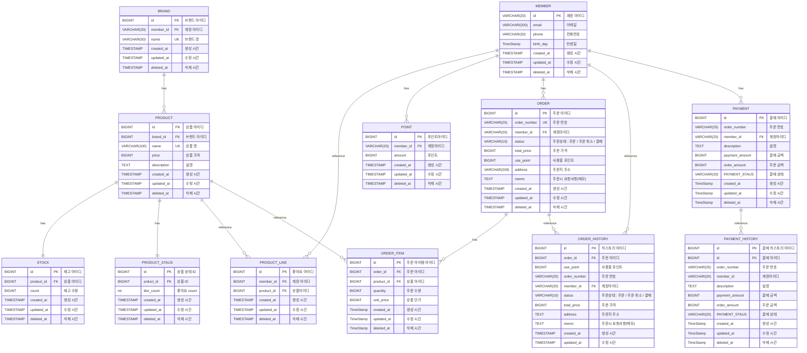

# ERD 다이어그램

```mermaid
erDiagram
%%브랜드    
BRAND {
 BIGINT id PK "브랜드 아이디"
 VARCHAR(20) member_id FK "계정 아이디"
 VARCHAR(50) name UK "브랜드 명"

 TIMESTAMP created_at "생성 시간"
 TIMESTAMP updated_at "수정 시간"
 TIMESTAMP deleted_at "삭제 시간"
}

%%상품
PRODUCT {
 BIGINT id PK "상품 아이디"
 BIGINT brand_id FK "브랜드 아이디"
 VARCHAR(100) name UK "상품 명"
 BIGINT price "상품 가격"
 TEXT   description "설명"

 TIMESTAMP created_at "생성 시간"
 TIMESTAMP updated_at "수정 시간"
 TIMESTAMP deleted_at "삭제 시간"
}

%%재고
STOCK {
 BIGINT id PK "재고 아이디"
 BIGINT product_id FK "상품 아이디"
 BIGINT count "재고 수량"
 TIMESTAMP created_at "생성 시간"
 TIMESTAMP updated_at "수정 시간"
 TIMESTAMP deleted_at "삭제 시간" 
}

%%좋아요
PRODUCT_LIKE {
 BIGINT id PK "좋아요 아이디"   
 BIGINT member_id FK "계정 아이디"
 BIGINT product_id FK "상품아이디"
 
 TIMESTAMP created_at "생성 시간"
 TIMESTAMP updated_at "수정 시간"
 TIMESTAMP deleted_at "삭제 시간"
}

%%좋아요된 상품
PRODUCT_STAUS { 
 BIGINT id PK "상품 상태 ID"
 BIGINT prduct_id FK "상품 ID"
 int like_count "좋아요 count"
 TIMESTAMP created_at "생성 시간"
 TIMESTAMP updated_at "수정 시간"
 TIMESTAMP deleted_at "삭제 시간"
}

%% 계정
MEMBER {
 VARCHAR(20) id PK "계정 아이디"
 VARCHAR(200) email "이메일"
 VARCHAR(20) phone "전화번호"
 TimeStamp birth_day "탄생일"
 TIMESTAMP created_at "생성 시간"
 TIMESTAMP updated_at "수정 시간"
 TIMESTAMP deleted_at "삭제 시간"
}

%% 포인트
POINT {
 BIGINT id PK "포인트아이디"
 VARCHAR(20) member_id FK "계정아이디"
 BIGINT amount "포인트"

 TIMESTAMP created_at "생성 시간"
 TIMESTAMP updated_at "수정 시간"
 TIMESTAMP deleted_at "삭제 시간"
}


%% 주문
ORDER {
 BIGINT id PK "주문 아이디"
 VARCHAR(25) order_number UK "주문 번호"
 VARCHAR(20) member_id FK "계정아이디" 
 VARCHAR(10) status "주문상태 : 주문 / 주문 취소 / 결제"
 
 BIGINT total_price "주문 가격"    
 
 BIGINT use_point "사용할 포인트"
 
 VARCHAR(200) address "주문지 주소"
 TEXT memo "주문시 요청사항(메모)"

 TIMESTAMP created_at "생성 시간"
 TIMESTAMP updated_at "수정 시간"
 TIMESTAMP deleted_at "삭제 시간" 
}

%% 주문 아이템
ORDER_ITEM {
 BIGINT id PK "주문 아이템 아이디"
 BIGINT order_id FK "주문 아이디"
 BIGINT product_id FK "상품 아이디"
    
 BIGINT quantity "주문 수량"
 BIGINT unit_price "상품 단가"
 
 TimeStamp created_at "생성 시간"
 TimeStamp updated_at "수정 시간"
 TimeStamp deleted_at "삭제 시간"
}

%% 주문 히스토리
ORDER_HISTORY {
 BIGINT id PK "히스토리 아이디"
 BIGINT order_id FK "주문 아이디"
 BIGINT use_point "사용할 포인트"
 VARCHAR(25) order_number "주문 번호"
 VARCHAR(20) member_id FK "계정아이디"
 VARCHAR(10) status "주문상태 : 주문 / 주문 취소 / 결제"
 
 BIGINT total_price "주문 가격"
 TEXT address "주문지 주소"

 TEXT memo "주문시 요청사항(메모)"

 TIMESTAMP created_at "생성 시간"
 TIMESTAMP updated_at "수정 시간"
}

%% 결제 
PAYMENT {
 BIGINT id PK "결제 아이디"
 VARCHAR(25) order_number "주문 번호"
 VARCHAR(20) member_id FK "계정아이디"
 TEXT description "설명"
 BIGINT payment_amount "결제 금액"
 BIGINT order_amount "주문 금액"
 VARCHAR(20) PAYMENT_STAUS "결제 상태"
 TimeStamp created_at "생성 시간"
 TimeStamp updated_at "수정 시간"
 TimeStamp deleted_at "삭제 시간"    
}

%% 결제 내역
PAYMENT_HISTORY {
 BIGINT id PK "결제 히스토리 아이디"   
 BIGINT id FK "결제 아이디"
 VARCHAR(25) order_number "주문 번호"
 VARCHAR(20) member_id "계정아이디"
 TEXT description "설명"
 BIGINT payment_amount "결제 금액"
 BIGINT order_amount "주문 금액"
 VARCHAR(20) PAYMENT_STAUS "결제 상태"
 TimeStamp created_at "생성 시간"
 TimeStamp updated_at "수정 시간"
 TimeStamp deleted_at "삭제 시간"
}

BRAND ||--o{PRODUCT : has
PRODUCT || -- || STOCK : has
PRODUCT  || -- || PRODUCT_STAUS : has

PRODUCT || -- o{PRODUCT_LIKE  : reference
MEMBER || -- o{PRODUCT_LIKE : reference


MEMBER || -- o{ POINT : has

MEMBER || -- o{ ORDER : has

ORDER || -- o{ ORDER_ITEM : has
PRODUCT || --o{ ORDER_ITEM : reference

ORDER || -- o{ ORDER_HISTORY : reference
MEMBER || --o{ ORDER_HISTORY : reference

MEMBER || --o{PAYMENT : has 

PAYMENT || --o{ PAYMENT_HISTORY : reference
```
